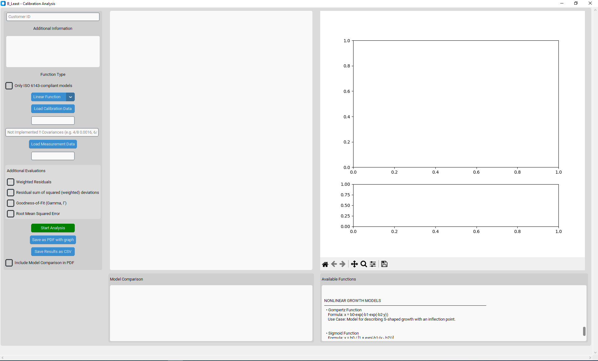

# b-least-analysis
*Analysis according to ISO 6143 and beyond*

A comprehensive Python application for analysis modeling — both linear and nonlinear — with full uncertainty propagation, visual inspection, automated reporting (PDF/CSV), and model comparison. Supports a wide range of functions from polynomials and exponentials to sigmoids, and complies with ISO 6143 analysis methodology.

## Features
- ISO 6143-compliant analysis

- Supports 14 different analysis models

- Full uncertainty propagation (incl. off-diagonal covariances)

- Automatic parameter estimation and robust fitting

- Intuitive GUI using Tkinter + CustomTkinter

- Visual output via Matplotlib (with confidence intervals)

- Export results as PDF (with graphs) or CSV

- Model diagnostics: RMSE, residual sum, Gamma (Γ)

- Weighted residual analysis

- Extensible architecture – easy to add new models or logic

## GUI Overview
The main interface consists of three panels:

**Left Panel:** Data loading, model selection, and analysis controls

**Center Panel:** Results, fitted equations, uncertainties

**Right Panel:** Plot with calibration points, fitted curve, confidence band

### Preview



## Supported Models
| Category                      | Model Name                  | Equation                                             |
|------------------------------|-----------------------------|------------------------------------------------------|
| ISO 6143 Compatible           | Linear                      | $x = b_0 + b_1 y$                                    |
|                              | Polynomial (order n)        | $x = b_0 + b_1 y + \dots + b_n y^n$                  |
|                              | Exponential                 | $x = b_0 + b_1 e^{b_2 y}$                            |
|                              | Power Function              | $x = b_0 + b_1 y^{(1 + b_2)}$                        |
| Exponential Growth            | Simple Exponential          | $x = b_0 e^{b_1 y}$                                  |
|                              | Exponential w/ Offset       | $x = b_0 + b_1 (e^{b_2 y} - 1)$                      |
| Saturation Models             | Rational Function           | $x = \frac{b_0 + b_1 y}{1 + b_2 y}$                  |
|                              | Hyperbolic Function         | $x = b_0 + \frac{b_1}{y + b_2}$                      |
| Logarithmic Models            | Logarithmic Function        | $x = b_0 + b_1 \ln(b_2 y)$                           |
|                              | Log-Linear Function         | $x = b_0 + b_1 \ln(y) + b_2 y$                       |
| Biological Curves             | Gompertz Function           | $x = b_0 \exp(-b_1 \exp(-b_2 y))$                    |
|                              | Sigmoid Function            | $x = \frac{b_0}{1 + \exp(-b_1 (y - b_2))}$           |
| Diffusion-like Models         | Square Root Function        | $x = b_0 + b_1 \sqrt{y}$                             |


## Installation

### Requirements

- Python **3.9** or newer
- Recommended: use a virtual environment (`venv` or `conda`)

### Install libraries
- [numpy](https://pypi.org/project/numpy/)
- [pandas](https://pypi.org/project/pandas/)
- [matplotlib](https://pypi.org/project/matplotlib/)
- [reportlab](https://pypi.org/project/reportlab/)
- [customtkinter](https://pypi.org/project/customtkinter/)

## How to Use
### Workflow
**1. Load Calibration Data:** CSV/TXT with columns x, u(x), y, u(y)

**2. Load Measurement Data:** CSV/TXT with columns y, u(y)

**3. Select Function Model (e.g., polynomial, exponential, etc.)**

**4.** Manually enter known covariances between calibration points *(currently in beta)*  
 Format: `2/4 0.0012, 3/4 0.0005`  
 ⚠️ Note: This feature is under development and may produce incorrect results in some cases.

**5. Run Analysis**

**6. Review Results:**

- Function equation + uncertainty per coefficient

- Residual analysis

- Fit quality metrics

**7. Export:**

- PDF Report with graph & optional model comparison

- CSV with full results and metadata

## Example File Format
Supported delimiters: tab (`\t`), semicolon (`;`) and comma (`,`).  

The delimiter is auto-detected from the first line of the file.
### Calibration Data
```
x;u(x);y;u(y)
10.2;1.0e-1;5.0e-1;1.0e-2
11.8;0.1;1.0;0.01
13.5;0.1;1.5;1.2e-2
```
### Measurement Data
```
y;u(y)
8.0e-1;1.0e-2
1.4;0.01
```

## Analysis Options
- Weighted Residuals: both x- and y-direction

- Sum of Squared Residuals (SSR): compared to ISO acceptance threshold

- Goodness-of-Fit Γ: maximum normalized deviation

- Root Mean Squared Error (RMSE)

## Export Contents
### CSV Includes:

- Metadata (timestamp, selected function, user input)

- Calibration + Measurement Data

- Parameter estimates with uncertainties

- Covariance matrices (model parameters + predictions)

- Residuals + Diagnostics

### PDF Includes:
- Summary report in fixed-width layout

- Full analysis equation + parameter table

- Model graph with:

    - Calibration points (± uncertainty)

    - Measurement predictions

    - 95% confidence band

- Optional model comparison (all models + RMSE/Γ/SSR)

## Extensibility
The code is modular and extensible:

  - Add your own models via `compute_<model>()` functions

  - Extend GUI options with minimal changes

  - All visualizations and exports are handled via standard libraries (matplotlib, reportlab)

## License
Licensed under the [MIT License](LICENSE).

## Author
Tino Golub - Bundesanstalt für Materialforschung und -prüfung

Last updated: July 2025
 
Feel free to open issues or submit pull requests with suggestions or contributions.
